# LAB-002: Group Policy Management (GPO)

**Date:** 2026-05-18
**Difficulty:** Beginner
**Estimated Time:**  2 hours
**Status:** Completed

---

## Objective

Create and deploy Group Policy Objects (GPOs) to enforce security and 
configuration settings across domain users. This lab demonstrates how 
IT administrators use GPOs to manage user environments and apply security 
policies at scale, a core skill in any Windows corporate environment.

---

## Environment

| Component | Details |
|-----------|---------|
| Server OS | Windows Server 2022 |
| Client OS | Windows 11 Enterprise (VM - 90 day evaluation) |
| Virtualization | VirtualBox |
| Network Mode | Bridge |
| Server IP | 192.168.1.10 |
| Domain Name | corp.local |

---

## GPOs Created

| GPO | Linked To | Purpose |
|-----|-----------|---------|
| Block-Control-Panel | HR | Prevents users from accessing Control Panel |
| Corporate-Wallpaper | HR | Forces a corporate desktop wallpaper |
| Password-Policy | corp.local | Enforces password complexity and expiration |

---

## Steps Performed

### 1. Opening Group Policy Management Console

Group Policy Management Console (GPMC) was opened from Server Manager - 
Tools - Group Policy Management. The console shows the full domain 
structure including all OUs where GPOs can be linked.

---

### 2. GPO 1 -- Block Control Panel

A GPO was created and linked to the HR OU to prevent HR users from 
accessing the Control Panel. This is a common restriction in corporate 
environments to prevent users from modifying system settings.

Right-clicked on the HR OU - Create a GPO in this domain and Link it here 
- Named it Block-Control-Panel.

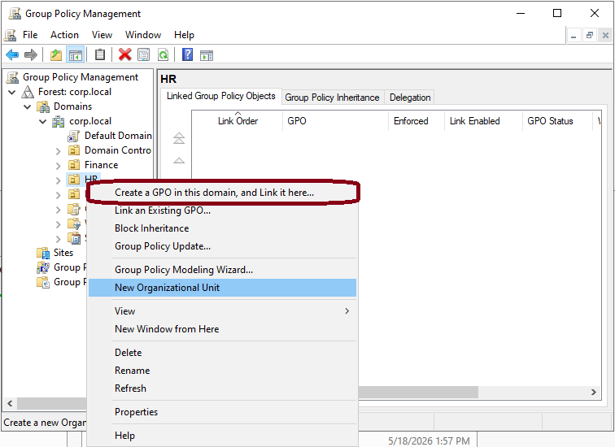

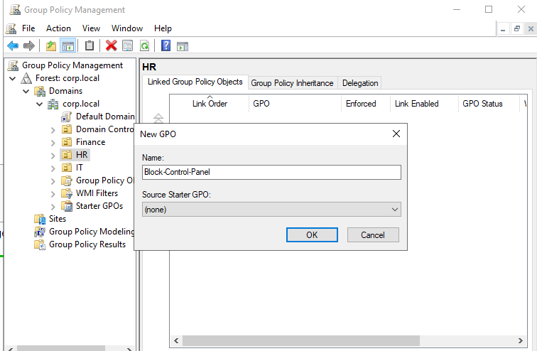

The GPO was then edited. Navigating to:
User Configuration - Policies - Administrative Templates - Control Panel`

The policy **Prohibit access to Control Panel and PC Settings** was set 
to **Enabled**.

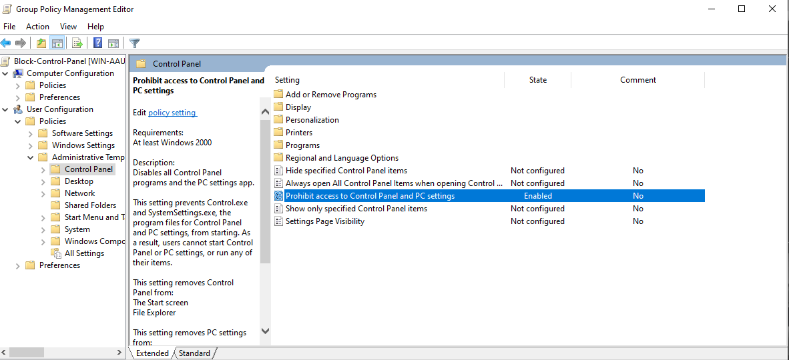

**Verification on Windows 11 client:**

'gpupdate /force' was run on the client machine logged in as jane.alicante 
to apply the policy immediately without waiting for the automatic refresh cycle.

 Note: GPOs apply automatically every 90 minutes. In a Help Desk environment, 
 gpupdate /force is used to apply policies immediately when needed.

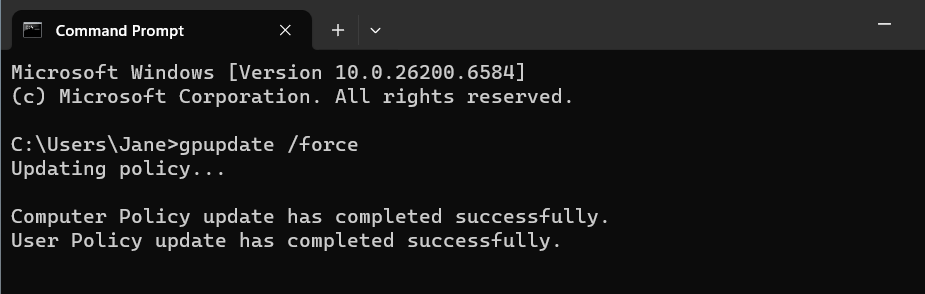

Attempting to open Control Panel resulted in the following restriction message, 
confirming the GPO was applied successfully.

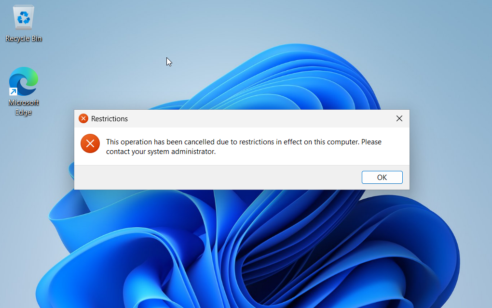

---

### 3. GPO 2 -- Corporate Wallpaper

A GPO was created and linked to the HR OU to enforce a corporate desktop 
wallpaper, preventing users from changing it. This is used in companies 
to maintain a professional and consistent appearance across all workstations.

The GPO was edited. Navigating to:
User Configuration → Policies → Administrative Templates → Desktop → Desktop`

The policy **Desktop Wallpaper** was set to **Enabled** with the following 
configuration:

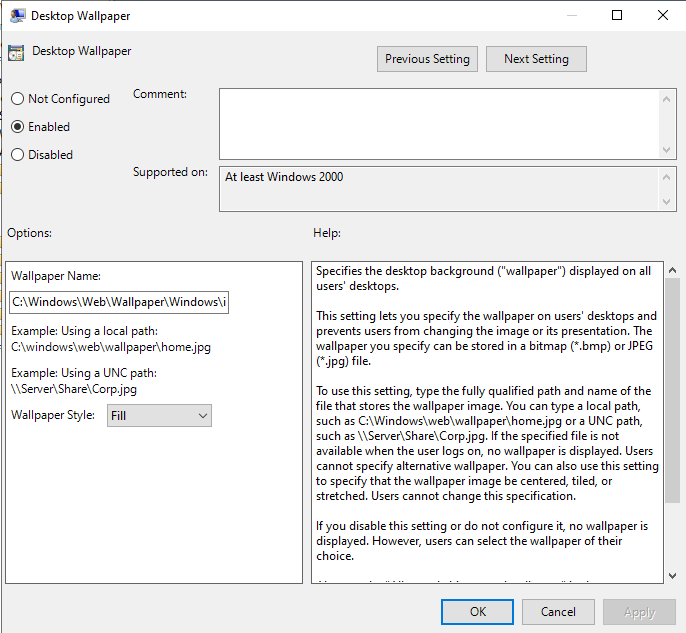

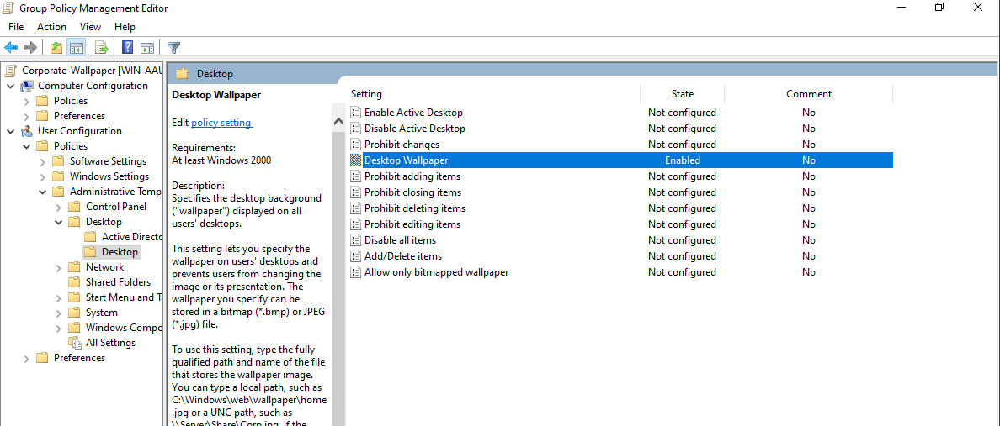

Both GPOs linked to the HR OU are visible and enabled.

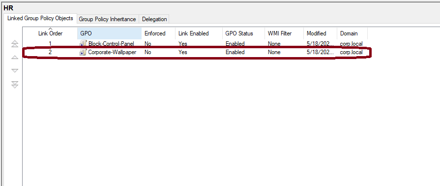

**Verification on Windows 11 client:**

`gpupdate /force` was run again and the session was restarted. The corporate 
wallpaper was applied successfully and the user cannot change it.

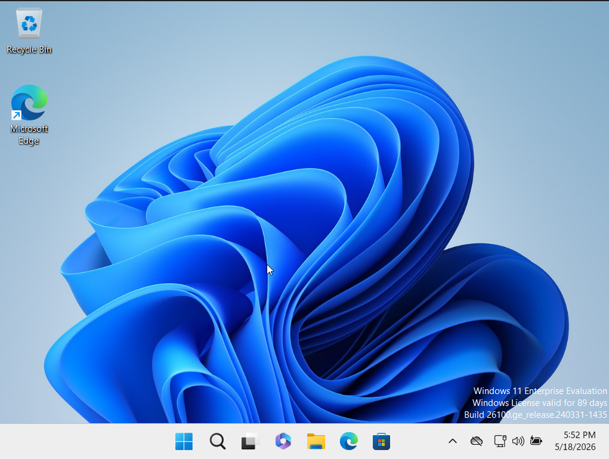

---

### 4. GPO 3 -- Password Policy

A Password Policy GPO was created and linked to the entire corp.local domain 
to enforce password security requirements for all users. Password policies 
are a fundamental security control. Weak passwords are one of the most 
common attack vectors in corporate environments.

Navigating to:
Computer Configuration - Policies - Windows Settings - Security Settings - 
Account Policies - Password Policy
`
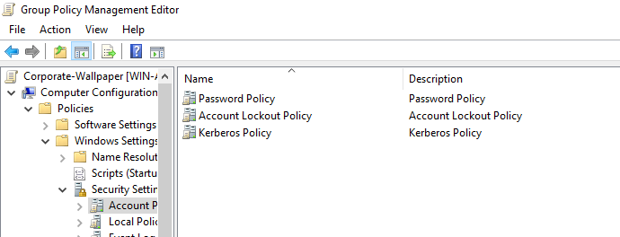

The following settings were configured:

| Policy | Value |
|--------|-------|
| Minimum password length | 8 characters |
| Password must meet complexity requirements | Enabled |
| Minimum password age | 1 day |
| Maximum password age | 90 days |

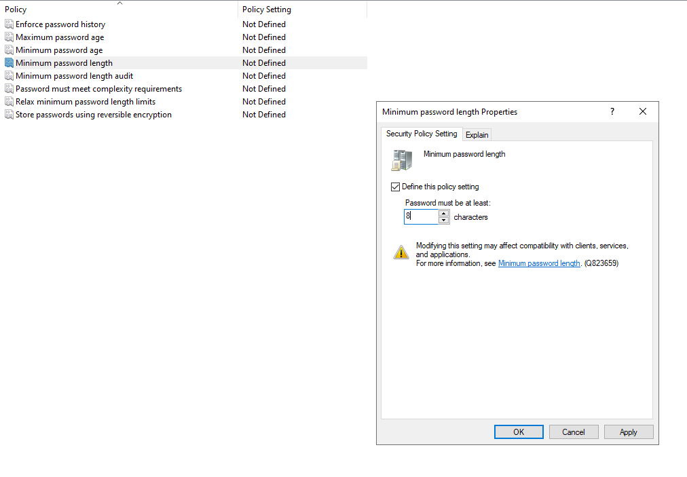

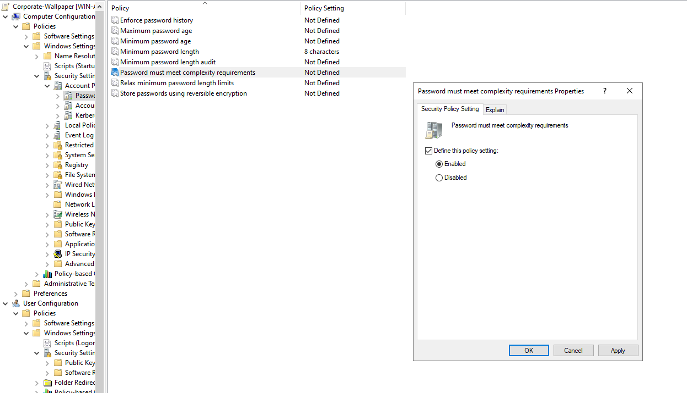

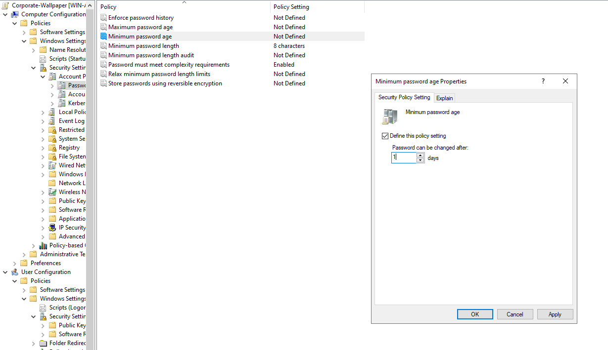

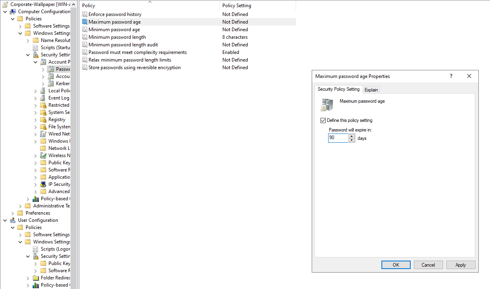

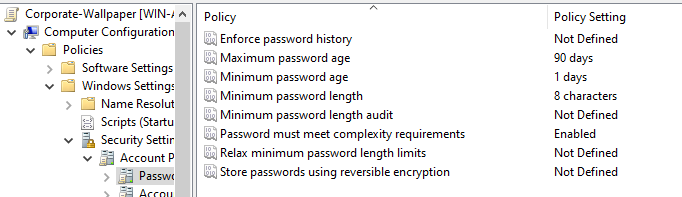

All three GPOs are now linked and enabled across the domain.

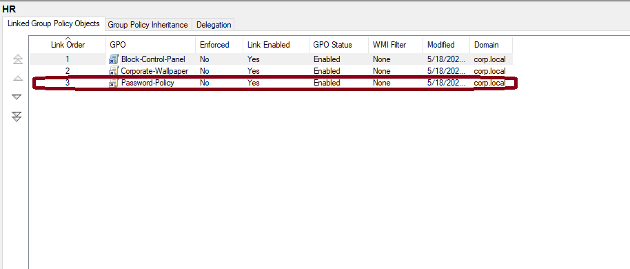

---

## Key Skills Demonstrated

- Created and linked GPOs to specific OUs and domain level
- Configured user restrictions using Administrative Templates
- Enforced corporate wallpaper across domain users
- Applied password security policies domain-wide
- Verified GPO application using gpupdate /force on client machine
- Understood GPO inheritance and link order

---

## What I Learned

A Group Policy Object (GPO) is a set of preventive rules applied to users 
or Organizational Units to enforce company policies and security standards. 
Before this lab, GPOs were just a concept, after building them hands-on, 
I understand how they work in practice.

I learned that GPOs are created and managed through the Group Policy 
Management Console (GPMC) and configured using the Group Policy Management 
Editor, where you navigate to the specific setting you want to enforce and 
enable it. 

I also understood the difference between linking a GPO to a specific OU 
versus the entire domain. Linking to an OU gives you granular control,
for example, blocking Control Panel only for HR without affecting IT. 
Linking to the domain applies the policy to everyone, which is appropriate 
for something like a Password Policy that should affect all users.

Finally, I learned that GPOs do not apply instantly, they refresh 
automatically every 90 minutes. In a Help Desk environment, `gpupdate /force` 
is used to apply policies immediately when troubleshooting or verifying 
that a new policy is working correctly.

---

## References

Creating a Group Policy Object (GPO): https://www.youtube.com/watch?v=ZmJwnpmsRYU

Active Directory | Create and Manage Group Policy (GPO) in Windows Server 2022: https://www.youtube.com/watch?v=H1VoikRbdw0