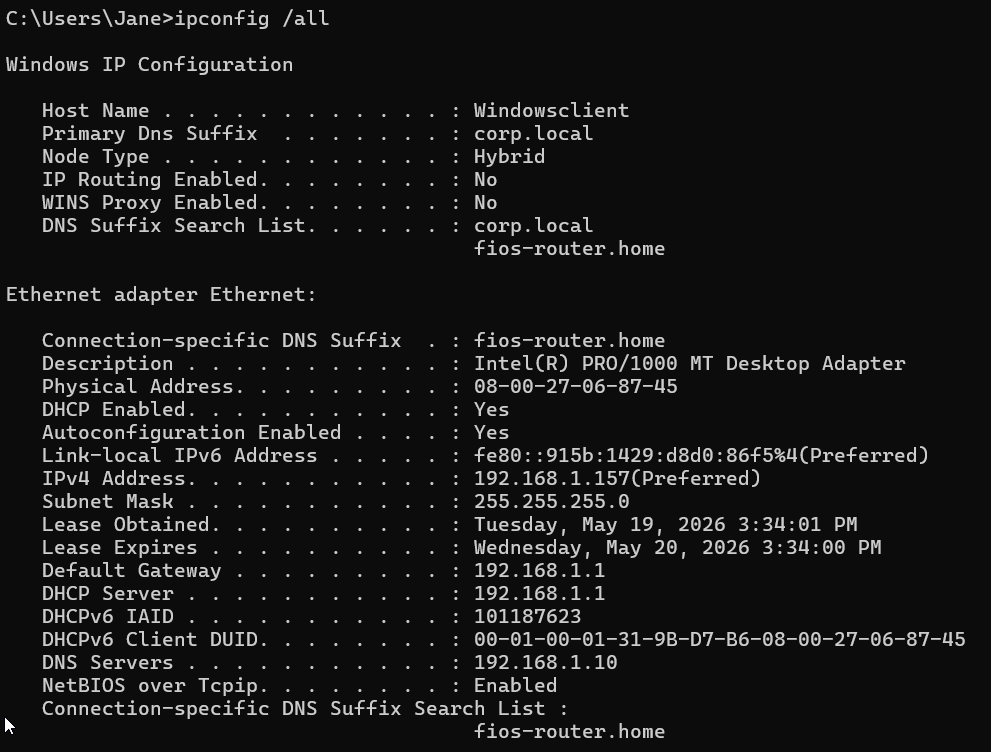
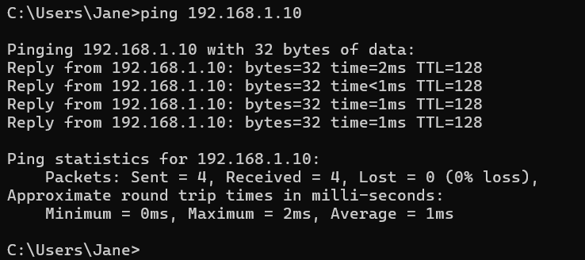
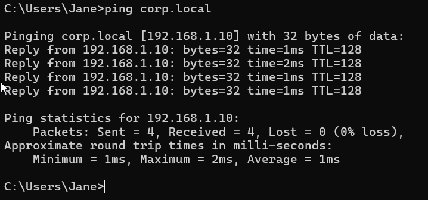
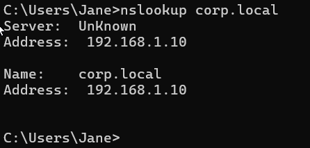
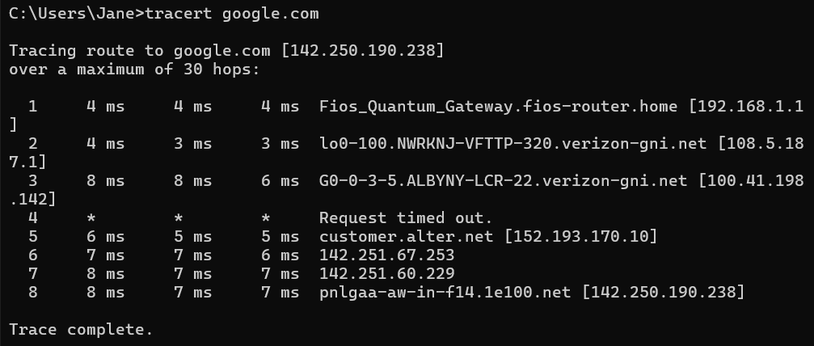

# LAB-003: Network Troubleshooting

**Date:** 2026-05-19
**Difficulty:** Beginner
**Estimated Time:** 45 minutes
**Status:** Completed

---

## Objective

Perform a routine network verification on a newly configured workstation 
before handing it off to the end user. This is a standard IT procedure 
to confirm that the machine is correctly configured, domain-joined, and 
can communicate with necessary network resources.

---

## Environment

| Component | Details |
|-----------|---------|
| Server OS | Windows Server 2022 |
| Client OS | Windows 11 Enterprise (VM - 90 day evaluation) |
| Virtualization | VirtualBox |
| Network Mode | Bridge |
| Server IP | 192.168.1.10 |
| Client IP | 192.168.1.157 |
| Domain Name | corp.local |

---

## Scenario

The IT department recently joined a new workstation (Windowsclient) to 
the corp.local domain. Before giving it to the end user, a routine 
network verification was performed to confirm the machine is correctly 
configured and can communicate with all necessary network resources.

---

## Steps Performed

### 1. ipconfig /all -- Network Configuration Review

The first step in any network verification is to review the full network 
configuration of the workstation. This confirms the IP address, subnet 
mask, default gateway, and DNS server are correctly set.

Key findings confirmed:
- **Host Name:** Windowsclient
- **IPv4 Address:** 192.168.1.157
- **Subnet Mask:** 255.255.255.0
- **Default Gateway:** 192.168.1.1
- **DNS Server:** 192.168.1.10-- correctly pointing to the Domain Controller
- **Primary DNS Suffix:** corp.local -- confirms the machine is domain-joined

---

### 2. ping 192.168.1.10 -- Connectivity Test by IP

A ping was sent directly to the Domain Controller's IP address to verify 
basic network connectivity between the workstation and the server.

Result: 4 packets sent, 4 received, 0% packet loss. Average response 
time of 1ms , well within acceptable range for a local network 
(anything under 10ms is considered healthy for LAN communication).

---

### 3. ping corp.local -- Connectivity Test by Domain Name

A ping was sent using the domain name to verify that DNS is resolving 
correctly. This test distinguishes between a network problem and a DNS 
problem,  if ping by IP works but ping by name fails, the issue is DNS.

Result: corp.local resolved to 192.168.1.10 successfully. 4 packets 
sent, 4 received, 0% packet loss -- DNS resolution confirmed.

---

### 4. nslookup corp.local -- DNS Resolution Verification

nslookup was used to directly query the DNS server and verify that 
corp.local resolves correctly. This provides more detail than ping — 
it shows exactly which DNS server is responding and what address it 
returns.

Result: DNS server at 192.168.1.10 resolved corp.local successfully — 
DNS is functioning correctly.

---

### 5. tracert google.com-- Internet Connectivity and Latency Verification

tracert was used to trace the full route from the workstation to an 
external destination, verifying internet connectivity and identifying 
latency at each hop.

Latency reference for Help Desk:
- **Under 10ms** -- excellent, same local network
- **10-50ms** -- good, normal internet traffic
- **50-100ms** -- acceptable, minor delays possible
- **Over 100ms** --degraded, user may notice slowness
- **Packet loss** -- critical, immediate investigation needed

The timeout at hop 4 is expected behavior -- many routers and ISP nodes 
block ICMP requests for security reasons. This does not indicate a 
problem as long as subsequent hops respond and the destination is reached.

---

## Verification Summary

| Test               | Result                                              | Status |
| ------------------ | --------------------------------------------------- | ------ |
| ipconfig /all      | IP, DNS, and Gateway correctly configured           | Pass   |
| ping by IP         | 0% packet loss, 1ms average                         | Pass   |
| ping by name       | DNS resolving correctly                             | Pass   |
| nslookup           | DNS server responding correctly                     | Pass   |
| tracert google.com | Internet reachable, latency within acceptable range |  Pass  |

All network diagnostics passed. The workstation is properly configured, 
domain-joined, and ready to be assigned to the end user.

---

## Key Skills Demonstrated

- Network configuration review using ipconfig /all
- Connectivity testing using ping by IP and by domain name
- DNS resolution verification using nslookup
- Internet connectivity and latency analysis using tracert
- Identifying acceptable vs problematic latency values
- Understanding of ICMP timeout behavior in tracert results

---

## What I Learned

Although I was already familiar with the main network troubleshooting 
commands from my Security+ studies, applying them in a real domain 
environment added a new layer of understanding. Knowing a command 
theoretically is different from running it on a domain-joined machine 
and interpreting the results in context.

The tracert analysis was particularly useful — understanding that a timed 
out hop does not always indicate a problem, and knowing how to read 
latency values to determine if a connection is healthy or degraded, are 
skills that go beyond basic connectivity testing.

---

## References

No external references used. Skills demonstrated are based on prior 
networking knowledge from CompTIA Security+ preparation.

Latency References:  https://www.optimum.com/articles/internet/what-is-latency