# LAB-004: Printer Management

**Date:** 2026-05-20
**Difficulty:** Beginner
**Estimated Time:** 1 hour
**Status:** Completed

---

## Objective

Install and configure a network printer on Windows Server 2022, share it 
across the domain, restrict access to a specific user, and verify 
connectivity from a domain-joined client machine. This lab simulates a 
common Help Desk task in any Windows corporate environment.

---

## Environment

| Component | Details |
|-----------|---------|
| Server OS | Windows Server 2022 |
| Client OS | Windows 11 Enterprise (VM - 90 day evaluation) |
| Virtualization | VirtualBox |
| Network Mode | Bridge |
| Server IP | 192.168.1.10 |
| Domain Name | corp.local |
| Printer Name | Corp-Printer-01 |
| Printer Driver | Microsoft PCL6 Class Driver |

---

## Steps Performed

### 1. Installing Print and Document Services Role

The Print and Document Services role was installed through Server Manager
using the Add Roles and Features wizard. This role enables Windows Server
to function as a print server and manage network printers centrally.

The following role services were selected during installation:
- Print Server
- Internet Printing

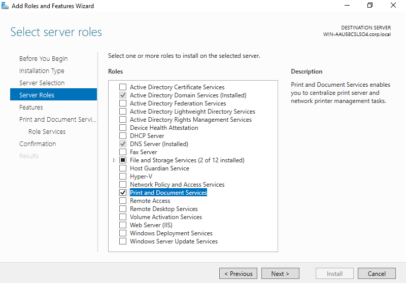
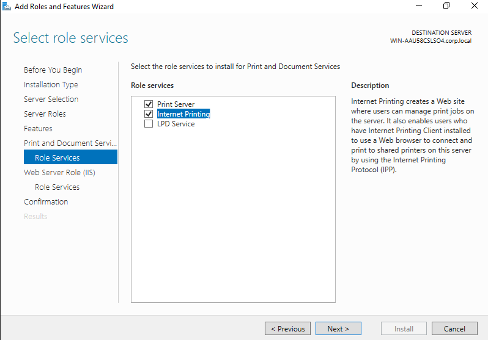

After installation, Print Management appeared under Server Manager Tools,
confirming the role was installed successfully.

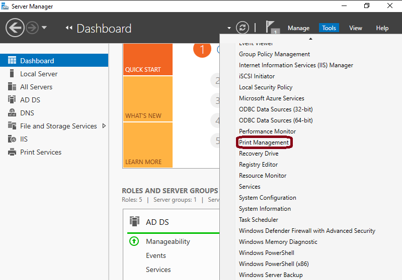

---

### 2. Adding the Network Printer

Print Management was opened from Server Manager. The printer was added by
right-clicking the server under Print Servers and selecting Add Printer.

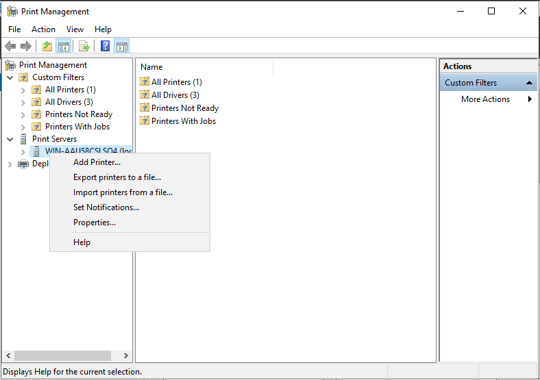

In the Network Printer Installation Wizard the following options were selected:

- Installation method: Add a new printer using an existing port - LPT1

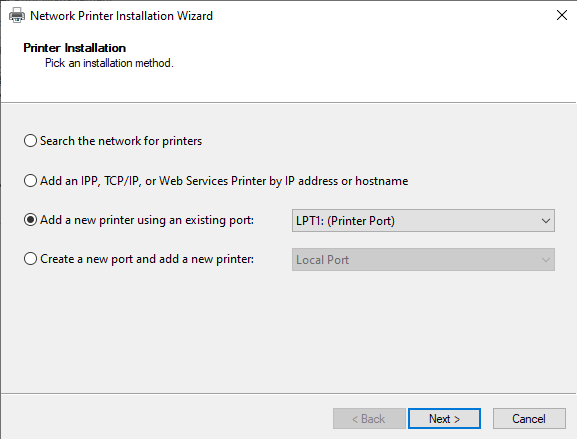

The Microsoft PCL6 Class Driver was selected as the printer driver. PCL6 is
a standard industry driver compatible with most printers and fully supports
network sharing, making it the appropriate choice.

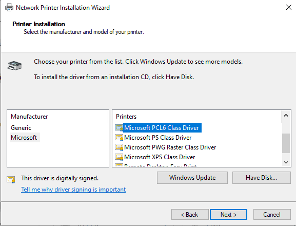

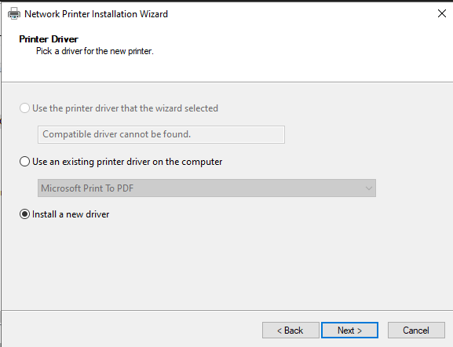

Printer was named: Corp-Printer-01

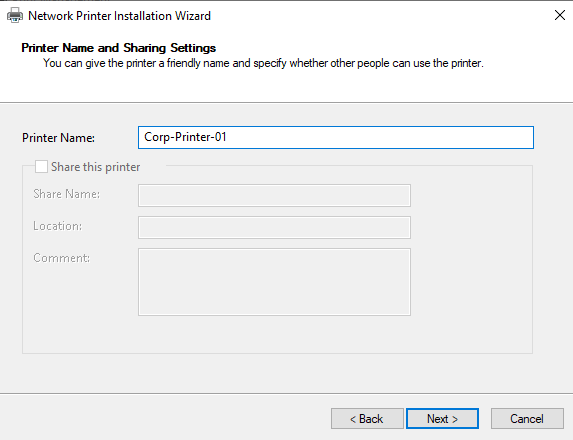

---

### 3. Sharing the Printer

After the printer was created, sharing was configured through the printer
properties. The Share this printer option was enabled with the share name
Corp-Printer-01, making it accessible to domain users on the network.

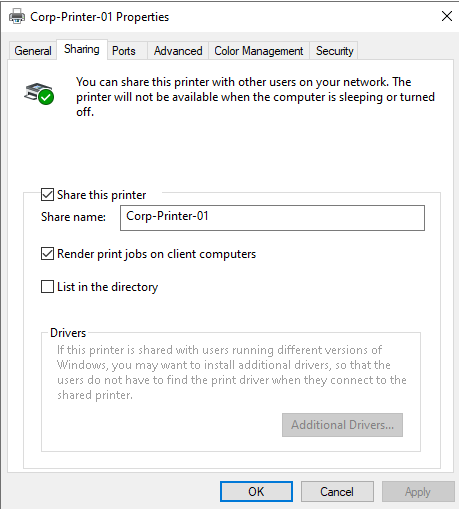

---

### 4. Restricting Access to a Specific User

Printer access was restricted to Jane Alicante giving only access to `Print` action  through the Security tab in the printer properties. This simulates a real corporate scenario
where a specific printer is assigned to a specific user or department.

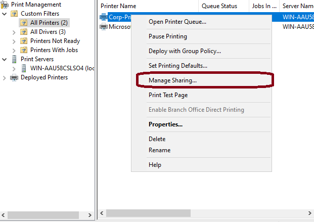
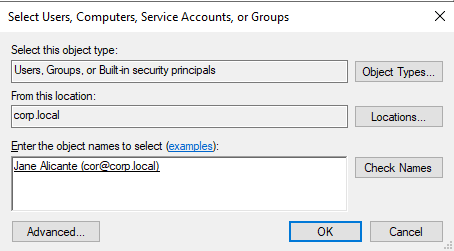
---

### 5. Applying Group Policy Update on Client

After configuring the printer on the server, gpupdate /force was run on
the client machine logged in as jane.alicante to apply the latest policies
before attempting to connect to the printer.

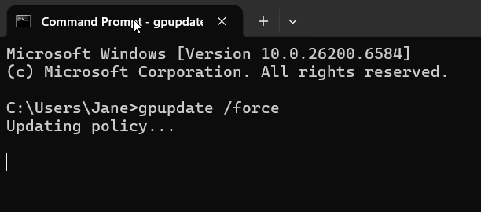

---

### 6. Verifying Printer Connectivity from Client

The printer was accessed from the Windows 11 client by navigating to the
server share ( \\\192.168.1.10 ) in File Explorer: Corp-Printer-01 appeared in the shared resources list alongside the domain
Confirming the printer is correctly shared
on the network.

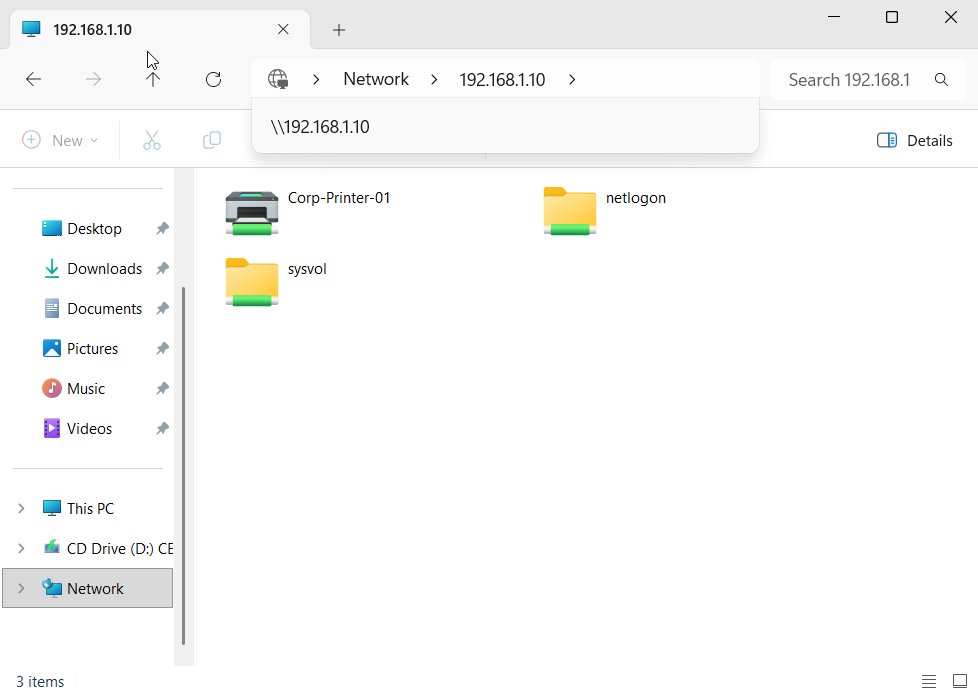

Double-clicking Corp-Printer-01 opened the print queue interface, confirming
that jane.alicante can successfully connect to and use the network printer.

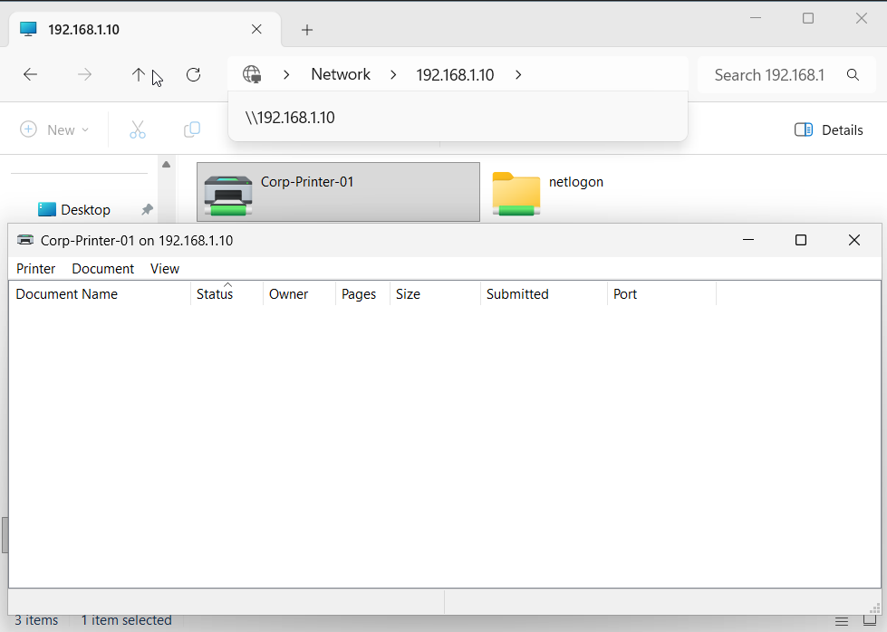

---

## Errors and Troubleshooting

| Error                                      | Cause                                       | Solution                                                                 |
| ------------------------------------------ | ------------------------------------------- | ------------------------------------------------------------------------ |
| Microsoft Print to PDF could not be shared | PDF driver does not support network sharing | Replaced with Microsoft PCL6 Class Driver which supports network sharing |

---

## Key Skills Demonstrated

- Installation of Print and Document Services role on Windows Server 2022
- Adding and configuring a network printer using Print Management Console
- Selecting appropriate printer drivers for network environments
- Sharing a printer across a Windows domain
- Restricting printer access to specific domain users
- Verifying printer connectivity from a domain-joined client machine

---

## What I Learned

## What I Learned

This lab introduced me to printer management in a Windows Server environment,
which is one of the most common tasks in a Help Desk role. I learned how to
install the Print and Document Services role, add a network printer through
the Print Management Console, and share it across the domain so domain users
can connect to it from their workstations.

I also learned about printer drivers and their role in network environments.
The PCL6 driver is a standard industry driver that supports network sharing,
which is why it was chosen over Microsoft Print to PDF — which only works
locally and cannot be shared across the network.

I also got a better understanding of NETLOGON and SYSVOL — two system shared
folders that are always present on a Domain Controller. NETLOGON stores login
scripts that run when a user authenticates to the domain, and SYSVOL stores
all Group Policy configurations. Seeing them appear alongside Corp-Printer-01
when browsing the server share helped me understand the full picture of what
a Domain Controller shares on the network.

Lastly I saw protocols that I studied, specifically Line Print Terminal (LPT) protocol which I learned in my CompTIA Security+ training.

---

## References

How to install Print and Document Services Windows Server 2022: https://www.youtube.com/watch?v=QVMi3QqOd6A

Install and configure Print and Document Services - Microsoft Learn: https://learn.microsoft.com/en-us/previous-versions/windows/it-pro/windows-server-2012-r2-and-2012/jj134159(v=ws.11)